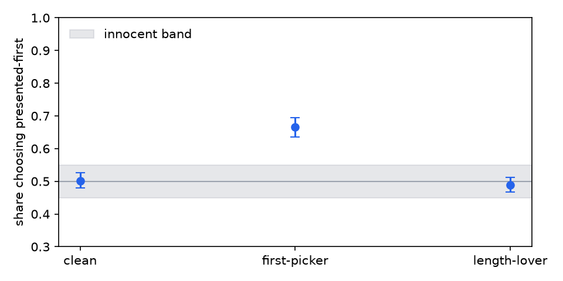
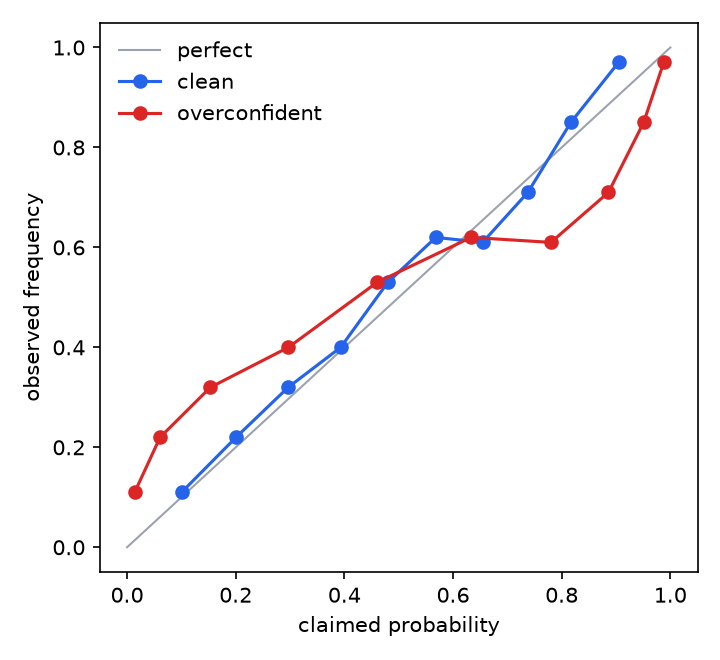

# judgekit

Audit an LLM judge before you trust it.

[](https://github.com/mohammadi-hadi/judgekit/actions/workflows/ci.yml)
[](https://doi.org/10.5281/zenodo.21802868)

An LLM judge is a model too. It can prefer whichever answer came first, reward
padding, favor its own outputs, hug the middle of the scale, and say "90%
sure" while being right 70% of the time — all while agreeing with your
annotators often enough to look fine. judgekit reads a JSONL of verdicts and
measures each of these failure modes with a bootstrap confidence interval,
then flags whatever leaves the range an innocent judge could occupy.

## The audit in one table

Six synthetic judges, five implanted defects. Bold values are flags; each lands
exactly where the defect was implanted, and the clean judge's row carries none.

<!-- judgekit:demo -->
| judge | implanted defect | kappa_qw | position | verbosity | self-pref | spread | ECE | flags |
|---|---|---|---|---|---|---|---|---|
| clean | nothing | 0.96 | 0.50 | -0.03 | -0.04 | 1.02 | 0.03 | none |
| first-picker | takes the presented-first candidate 35% of the time | - | **0.67** | - | - | - | - | position preference |
| length-lover | adds standardized length to perceived quality | 0.80 | 0.49 | **0.82** | -0.14 | 1.00 | - | verbosity bias, verbosity bias (pairwise) |
| self-server | adds one scale point when the candidate is its own model | 0.89 | - | 0.05 | **0.76** | 0.97 | - | self-preference |
| middler | halves every departure from the scale midpoint | 0.76 | - | -0.03 | 0.00 | **0.63** | - | central tendency |
| overconfident | sharpens every claimed probability on the logit scale | - | - | - | - | - | **0.11** | expected calibration error |
<!-- /judgekit:demo -->

The row to sit with is `length-lover`: quadratic-weighted kappa with humans of
0.80 — a number most eval writeups would celebrate — while carrying a verbosity
bias of +0.82. Agreement is not an audit.

`make demo` regenerates this table, the [full report](results/report.md) and
the figures from fixed seeds; CI rebuilds them from pinned dependencies and
fails if a committed number differs from what the code produces.





## Two real judges, audited

[`examples/audit_ollama.py`](examples/audit_ollama.py) builds a small
adversarial arithmetic benchmark — one answer provably correct by
construction, and half the time the wrong answer is the long, worked-through
one — then asks a local Ollama model to judge every pair in both presentation
orders. Verdicts and full reports are committed under
[examples/results](examples/results/).

| judge (temperature 0) | truth agreement | position preference | verbosity excess | flips under swap | decisive on identical pairs |
|---|---|---|---|---|---|
| aya-expanse:8b | 0.433 | **0.910** (flag) | +0.106 | 0.819 | 1.000 |
| qwen2.5:14b | 0.667 | **0.768** (flag) | +0.131 | 0.568 | 0.200 |
| llama3.1:8b | 0.443 | 0.576 | **+0.483** (flag) | 0.171 | 1.000 |

Same task, different failure modes at different severities. Two judges follow
slot order — aya picks whatever is presented first 91.0% of the time and flips
81.9% of pairs when the order is swapped; qwen sits at 76.8% and 56.8%. The
llama judge grades effort instead, picking the longer answer 48 points more
often than correctness warrants and agreeing with ground truth less often than
a coin flip. Two of the three never once declare a tie between identical
answers. n=105 pairs, adversarial by construction — an illustration of what
the probes see, not a model leaderboard.

## Install

```
pip install judgekit
```

Python 3.11+. Runtime dependencies: numpy, pydantic, matplotlib. The
development version installs with
`pip install git+https://github.com/mohammadi-hadi/judgekit`.

## Quickstart

Write one JSON object per verdict. Three kinds exist, and every check switches
on automatically when the fields it needs are present:

```json
{"kind": "graded",   "item_id": "q101", "score": 4, "candidate_len": 512, "candidate_model": "gpt-4o"}
{"kind": "binary",   "item_id": "q102", "label": true, "confidence": 0.9}
{"kind": "pairwise", "item_id": "q103", "choice": "a", "swapped": true, "a_len": 210, "b_len": 480}
```

The reference file uses the same records (`judge_id: "human"`), aligned on
`item_id`. For pairwise verdicts, `choice` is always in canonical space —
`"a"` means canonical candidate A won regardless of which slot it was shown
in — and `swapped: true` records that the pair was presented in reversed
order. Judging every pair in both orders is what makes the position probes
assumption-free.

```python
from judgekit import load_verdicts, run_audit

audit = run_audit(
    load_verdicts("judge.jsonl"),
    load_verdicts("human.jsonl"),
    judge_model="gpt-4o",  # enables the self-preference probe
)
for flag in audit.flags:
    print(flag.name, "--", flag.detail)
```

Or from the shell, with an exit code CI can gate on:

```
judgekit report judge.jsonl --human human.jsonl --out audit --fail-on-flags
```

Alongside `report.md` the audit writes `report.json` for pipelines that gate
on specific numbers. Any check that could not run is listed in the report with
the exact fields to log to enable it — a skip describes the log file, not the
judge.

## What it checks

| check | question it answers | needs |
|---|---|---|
| position preference | does the judge favor the first slot? | pairwise verdicts, both orders |
| swap flip rate | how often does order alone decide? | both orders per pair |
| identical-pair decisiveness | verdicts between identical texts | pairs with `meta.identical` |
| verbosity bias | length preference at fixed quality | scores, `candidate_len`, human scores |
| self-preference | generosity toward its own model | `candidate_model`, human scores |
| central tendency | compression toward the scale middle | graded + human scores |
| calibration (ECE, Brier) | are confidences frequencies? | binary verdicts with `confidence` |
| re-judgment unanimity | sampling stability | repeats via `sample_index` |
| agreement (kappa, rho, exact) | does it match the reference at all? | judge + human verdicts |

## How the numbers are defended

- **Cross-checked implementations.** Cohen's kappa (all weightings) matches
  scikit-learn, Krippendorff's alpha matches the krippendorff package, and
  Spearman matches scipy to 1e-10 or better in the test suite. The library
  itself depends on none of them.
- **Exact identities.** The Brier score must equal reliability − resolution +
  uncertainty from its Murphy decomposition at machine precision; the tests
  assert it.
- **Validation by implantation.** The synthetic judges have defect dials, and
  the tests require each probe to recover its dial — a 0.4 position override
  must read as 0.7 first-slot preference — to stay monotone in it, and to stay
  silent on the clean judge, including a world where longer answers genuinely
  are better and the raw length correlation would convict an honest judge.
- **Drift-checked results.** Every number above and in
  [results/report.md](results/report.md) is regenerated by CI from pinned
  dependencies and diffed against the committed copy.

## Design notes

- **Innocent bands, not point nulls.** With enough data a spread ratio of 1.04
  excludes 1.0 while meaning nothing. Each triggering probe declares the band a
  defect-free judge could plausibly occupy — position 0.45–0.55, correlations
  ±0.10, self-preference ±0.20 scale points, spread 0.90–1.10, ECE ≤ 0.05 —
  and flags only when the whole 95% interval leaves it. The bands are opinions,
  stated in one place ([`bias.py`](src/judgekit/bias.py)) and easy to disagree
  with.
- **Item-level bootstrap.** Re-judgments and swapped presentations of an item
  are resampled together; treating correlated rows as independent evidence
  would shrink every interval.
- **Bias triggers, instability informs.** A fair-but-noisy judge flips
  genuinely close pairs under swap, so the flip rate and identical-pair
  decisiveness are reported without flagging; systematic preference is what
  `position preference` triggers on.
- **Verbosity is a partial correlation.** Longer answers are often genuinely
  better, so score-vs-length is confounded with quality; the probe rank-partials
  the human score out. When length never varies independently of quality the
  answer is nan, because no verdict is the honest verdict.
- **Deterministic to the digit.** Seeded PCG64 resampling, no BLAS in any
  statistic's path, and a pinned drift environment: the same verdicts give the
  same report on any machine.

## Limitations

- An audit is bounded by what was logged. No lengths, no verbosity probe; no
  both-order presentations, weaker position probe; no re-judgments, no
  stability number.
- The human reference is treated as ground truth. Where annotators are noisy,
  judge-human disagreement is not all the judge's fault — with multiple raters,
  measure the human ceiling with `agreement.krippendorff_alpha` first.
- The innocent bands are judgment calls, not derivations.
- Implantation shows the probes detect the mechanisms simulated; real judges
  can fail in ways not simulated here.
- Verbosity control is linear in ranks of the human score; residual
  confounding remains possible.

## Related work

The failure modes measured here were documented by, among others: MT-Bench's
position, verbosity and self-enhancement analysis ([Zheng et al., 2023](https://arxiv.org/abs/2306.05685)),
position bias specifically ([Wang et al., 2023](https://arxiv.org/abs/2305.17926)),
adversarial judge evaluation ([Zeng et al., 2024](https://arxiv.org/abs/2310.07641)),
self-recognition and self-preference ([Panickssery et al., 2024](https://arxiv.org/abs/2404.13076)),
rubric-based judging ([Liu et al., 2023](https://arxiv.org/abs/2303.16634)) and
the LLM-as-a-judge survey ([Gu et al., 2024](https://arxiv.org/abs/2411.15594)).
judgekit's contribution is packaging the checks as one auditable tool with
uncertainty on every number and validation by implantation.

Companion projects: [trajectory-judge](https://github.com/mohammadi-hadi/trajectory-judge)
measures what outcome-only judges miss on agent trajectories;
[EvalMORAAL](https://github.com/mohammadi-hadi/EvalMORAAL) applies
chain-of-thought judging to moral alignment across 20 models.

## Citation

If judgekit is useful in your research, please cite it (see
[CITATION.cff](CITATION.cff)):

```bibtex
@software{mohammadi_judgekit,
  author  = {Mohammadi, Hadi},
  title   = {judgekit: audit an LLM judge before you trust it},
  url     = {https://github.com/mohammadi-hadi/judgekit},
  doi     = {10.5281/zenodo.21802869},
  version = {0.2.0},
  year    = {2026}
}
```

## License

MIT
