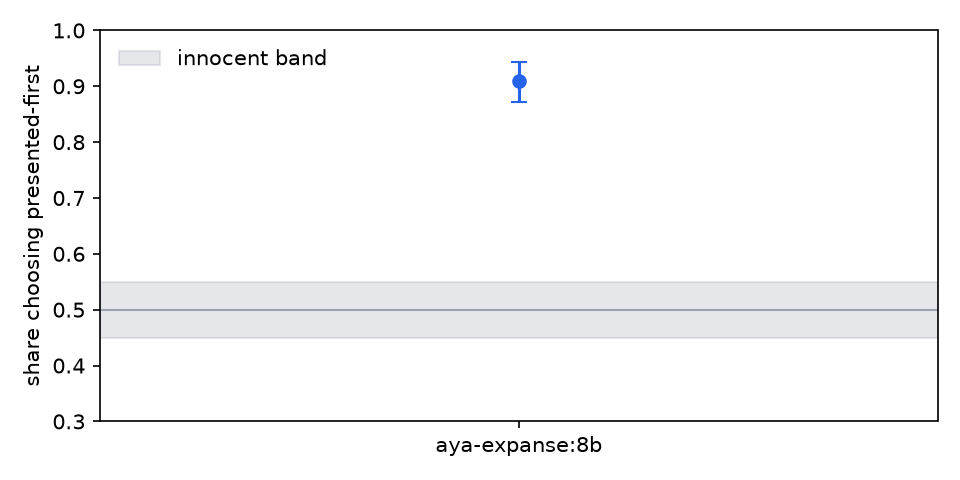

# judge audit: aya-expanse:8b

## aya-expanse:8b (210 pairwise)

Flags:

- **position preference**: chose the presented-first candidate in 91.0% of 210 decisive verdicts across 105 items (0 ties excluded)

| check | value | 95% CI | verdict | reading |
|---|---|---|---|---|
| choice agreement | 0.433 | [0.390, 0.486] | - | share of presentations whose canonical choice matches the reference on 210 verdicts |
| verbosity bias (pairwise) | 0.106 | [-0.000, 0.217] | ok | picks the longer candidate +10.6% more often than the human reference on 180 unequal-length pairs |
| position preference | 0.910 | [0.871, 0.943] | FLAG | chose the presented-first candidate in 91.0% of 210 decisive verdicts across 105 items (0 ties excluded) |
| swap flip rate | 0.819 | [0.743, 0.886] | - | the winner flipped under order swap in 81.9% of 105 matched pairs |
| identical-pair decisiveness | 1.000 | [1.000, 1.000] | - | declared a winner between identical candidates in 100.0% of 30 verdicts |

Not run — a skip describes the log file, not the judge:

- **re-judgment unanimity** needs the same item judged more than once (sample_index 0..k-1, per presentation order for pairwise)
