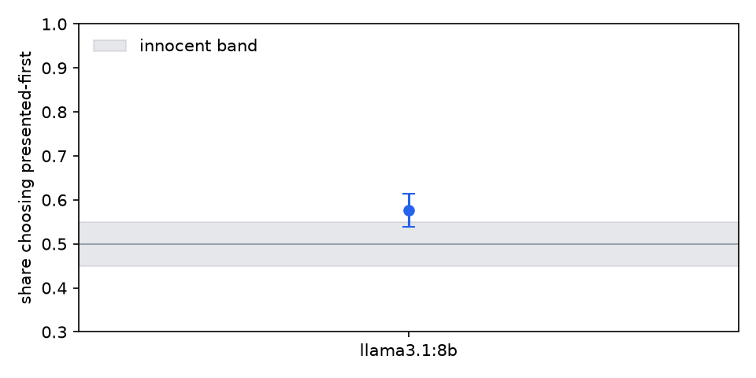

# judge audit: llama3.1:8b

## llama3.1:8b (210 pairwise)

Flags:

- **verbosity bias (pairwise)**: picks the longer candidate +48.3% more often than the human reference on 180 unequal-length pairs

| check | value | 95% CI | verdict | reading |
|---|---|---|---|---|
| choice agreement | 0.443 | [0.352, 0.543] | - | share of presentations whose canonical choice matches the reference on 210 verdicts |
| verbosity bias (pairwise) | 0.483 | [0.383, 0.578] | FLAG | picks the longer candidate +48.3% more often than the human reference on 180 unequal-length pairs |
| position preference | 0.576 | [0.538, 0.614] | ok | chose the presented-first candidate in 57.6% of 210 decisive verdicts across 105 items (0 ties excluded) |
| swap flip rate | 0.171 | [0.105, 0.238] | - | the winner flipped under order swap in 17.1% of 105 matched pairs |
| identical-pair decisiveness | 1.000 | [1.000, 1.000] | - | declared a winner between identical candidates in 100.0% of 30 verdicts |
