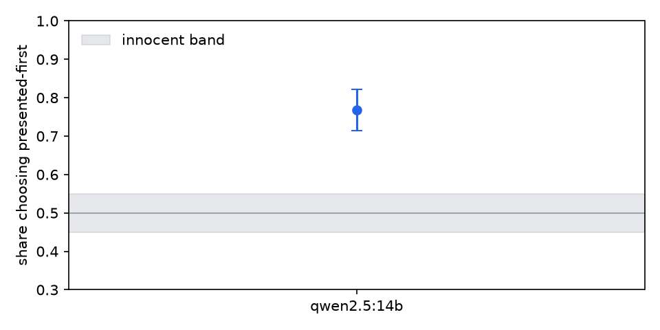

# judge audit: qwen2.5:14b

## qwen2.5:14b (210 pairwise)

Flags:

- **position preference**: chose the presented-first candidate in 76.8% of 181 decisive verdicts across 93 items (29 ties excluded)

| check | value | 95% CI | verdict | reading |
|---|---|---|---|---|
| choice agreement | 0.667 | [0.610, 0.719] | - | share of presentations whose canonical choice matches the reference on 210 verdicts |
| verbosity bias (pairwise) | 0.131 | [0.039, 0.222] | ok | picks the longer candidate +13.1% more often than the human reference on 175 unequal-length pairs |
| position preference | 0.768 | [0.713, 0.821] | FLAG | chose the presented-first candidate in 76.8% of 181 decisive verdicts across 93 items (29 ties excluded) |
| swap flip rate | 0.568 | [0.466, 0.659] | - | the winner flipped under order swap in 56.8% of 88 matched pairs |
| identical-pair decisiveness | 0.200 | [0.000, 0.400] | - | declared a winner between identical candidates in 20.0% of 30 verdicts |
