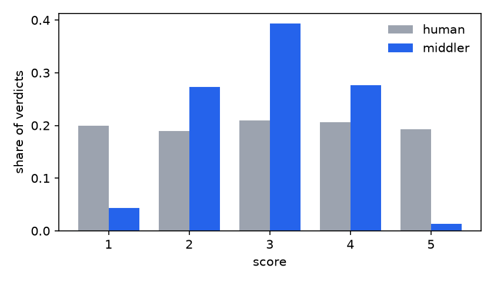

# judgekit demo report

Every judge is synthetic with a known implanted defect, so this report is also a test: bold flagged values must sit exactly where defects were implanted, and the clean judge's row must carry none.

| judge | implanted defect | kappa_qw | position | verbosity | self-pref | spread | ECE | flags |
|---|---|---|---|---|---|---|---|---|
| clean | nothing | 0.96 | 0.50 | -0.03 | -0.04 | 1.02 | 0.03 | none |
| first-picker | takes the presented-first candidate 35% of the time | - | **0.67** | - | - | - | - | position preference |
| length-lover | adds standardized length to perceived quality | 0.80 | 0.49 | **0.82** | -0.14 | 1.00 | - | verbosity bias, verbosity bias (pairwise) |
| self-server | adds one scale point when the candidate is its own model | 0.89 | - | 0.05 | **0.76** | 0.97 | - | self-preference |
| middler | halves every departure from the scale midpoint | 0.76 | - | -0.03 | 0.00 | **0.63** | - | central tendency |
| overconfident | sharpens every claimed probability on the logit scale | - | - | - | - | - | **0.11** | expected calibration error |

## clean (900 graded, 1000 binary, 800 pairwise)

No probe left its innocent band.

| check | value | 95% CI | verdict | reading |
|---|---|---|---|---|
| quadratic-weighted kappa | 0.962 | [0.954, 0.969] | - | chance-corrected ordinal agreement with the reference on 900 verdicts |
| spearman rho | 0.963 | [0.954, 0.969] | - | rank correlation with the reference scores |
| exact agreement | 0.849 | [0.824, 0.871] | - | share of verdicts equal to the reference score |
| within one point | 1.000 | [1.000, 1.000] | - | share of verdicts at most one scale point from the reference |
| label accuracy | 0.723 | [0.696, 0.749] | - | share of pass/fail labels matching the reference on 1000 verdicts |
| cohen kappa | 0.444 | [0.390, 0.496] | - | chance-corrected label agreement |
| choice agreement | 0.731 | [0.686, 0.772] | - | share of presentations whose canonical choice matches the reference on 800 verdicts |
| expected calibration error | 0.033 | [0.029, 0.068] | ok | mean gap between claimed confidence and observed frequency, equal-mass bins |
| brier score | 0.183 | n/a | - | decomposes exactly into reliability 0.183 - resolution 0.249 + uncertainty 0.249 |
| verbosity bias | -0.030 | [-0.094, 0.037] | ok | score-length rank correlation is -0.03 after controlling for the human score (raw -0.00, n=900) |
| self-preference | -0.043 | [-0.095, 0.009] | ok | scores its own model's candidates -0.04 scale points above its departure on others (300 own vs 600 other verdicts) |
| central tendency | 1.017 | [1.002, 1.032] | ok | judge score spread is 1.02x the human spread over 900 verdicts |
| verbosity bias (pairwise) | -0.018 | [-0.048, 0.011] | ok | picks the longer candidate -1.8% more often than the human reference on 611 unequal-length pairs |
| position preference | 0.502 | [0.479, 0.526] | ok | chose the presented-first candidate in 50.2% of 658 decisive verdicts across 200 items (142 ties excluded) |
| swap flip rate | 0.120 | [0.085, 0.160] | - | the winner flipped under order swap in 12.0% of 274 matched pairs |
| identical-pair decisiveness | 0.588 | [0.487, 0.675] | - | declared a winner between identical candidates in 58.8% of 80 verdicts |
| re-judgment unanimity | 0.617 | [0.567, 0.670] | - | all re-judgments of an item agreed in 61.7% of 300 re-judged sets; mean within-item score spread 0.24 |
| re-judgment unanimity | 0.635 | [0.578, 0.685] | - | all re-judgments of an item agreed in 63.5% of 400 re-judged sets |

## first-picker (800 pairwise)

Flags:

- **position preference**: chose the presented-first candidate in 66.5% of 666 decisive verdicts across 200 items (134 ties excluded)

| check | value | 95% CI | verdict | reading |
|---|---|---|---|---|
| choice agreement | 0.646 | [0.609, 0.682] | - | share of presentations whose canonical choice matches the reference on 800 verdicts |
| verbosity bias (pairwise) | 0.028 | [-0.015, 0.068] | ok | picks the longer candidate +2.8% more often than the human reference on 617 unequal-length pairs |
| position preference | 0.665 | [0.635, 0.694] | FLAG | chose the presented-first candidate in 66.5% of 666 decisive verdicts across 200 items (134 ties excluded) |
| swap flip rate | 0.365 | [0.312, 0.420] | - | the winner flipped under order swap in 36.5% of 282 matched pairs |
| identical-pair decisiveness | 0.613 | [0.512, 0.700] | - | declared a winner between identical candidates in 61.3% of 80 verdicts |
| re-judgment unanimity | 0.552 | [0.505, 0.603] | - | all re-judgments of an item agreed in 55.2% of 400 re-judged sets |

## length-lover (300 graded, 400 pairwise)

Flags:

- **verbosity bias**: score-length rank correlation is +0.82 after controlling for the human score (raw +0.50, n=300)
- **verbosity bias (pairwise)**: picks the longer candidate +34.9% more often than the human reference on 332 unequal-length pairs

| check | value | 95% CI | verdict | reading |
|---|---|---|---|---|
| quadratic-weighted kappa | 0.797 | [0.756, 0.833] | - | chance-corrected ordinal agreement with the reference on 300 verdicts |
| spearman rho | 0.796 | [0.754, 0.833] | - | rank correlation with the reference scores |
| exact agreement | 0.427 | [0.370, 0.487] | - | share of verdicts equal to the reference score |
| within one point | 0.923 | [0.890, 0.953] | - | share of verdicts at most one scale point from the reference |
| choice agreement | 0.590 | [0.525, 0.657] | - | share of presentations whose canonical choice matches the reference on 400 verdicts |
| verbosity bias | 0.821 | [0.786, 0.847] | FLAG | score-length rank correlation is +0.82 after controlling for the human score (raw +0.50, n=300) |
| self-preference | -0.135 | [-0.346, 0.090] | ok | scores its own model's candidates -0.14 scale points above its departure on others (100 own vs 200 other verdicts) |
| central tendency | 1.002 | [0.956, 1.059] | ok | judge score spread is 1.00x the human spread over 300 verdicts |
| verbosity bias (pairwise) | 0.349 | [0.279, 0.423] | FLAG | picks the longer candidate +34.9% more often than the human reference on 332 unequal-length pairs |
| position preference | 0.489 | [0.466, 0.511] | ok | chose the presented-first candidate in 48.9% of 352 decisive verdicts across 191 items (48 ties excluded) |
| swap flip rate | 0.056 | [0.025, 0.093] | - | the winner flipped under order swap in 5.6% of 161 matched pairs |
| identical-pair decisiveness | 0.500 | [0.350, 0.650] | - | declared a winner between identical candidates in 50.0% of 40 verdicts |

## self-server (300 graded)

Flags:

- **self-preference**: scores its own model's candidates +0.76 scale points above its departure on others (100 own vs 200 other verdicts)

| check | value | 95% CI | verdict | reading |
|---|---|---|---|---|
| quadratic-weighted kappa | 0.887 | [0.859, 0.912] | - | chance-corrected ordinal agreement with the reference on 300 verdicts |
| spearman rho | 0.903 | [0.880, 0.923] | - | rank correlation with the reference scores |
| exact agreement | 0.670 | [0.617, 0.727] | - | share of verdicts equal to the reference score |
| within one point | 0.963 | [0.940, 0.983] | - | share of verdicts at most one scale point from the reference |
| verbosity bias | 0.054 | [-0.064, 0.166] | ok | score-length rank correlation is +0.05 after controlling for the human score (raw +0.03, n=300) |
| self-preference | 0.755 | [0.612, 0.882] | FLAG | scores its own model's candidates +0.76 scale points above its departure on others (100 own vs 200 other verdicts) |
| central tendency | 0.974 | [0.938, 1.010] | ok | judge score spread is 0.97x the human spread over 300 verdicts |

## middler (300 graded)

Flags:

- **central tendency**: judge score spread is 0.63x the human spread over 300 verdicts

| check | value | 95% CI | verdict | reading |
|---|---|---|---|---|
| quadratic-weighted kappa | 0.765 | [0.729, 0.795] | - | chance-corrected ordinal agreement with the reference on 300 verdicts |
| spearman rho | 0.862 | [0.831, 0.889] | - | rank correlation with the reference scores |
| exact agreement | 0.443 | [0.390, 0.503] | - | share of verdicts equal to the reference score |
| within one point | 0.970 | [0.950, 0.987] | - | share of verdicts at most one scale point from the reference |
| verbosity bias | -0.032 | [-0.151, 0.082] | ok | score-length rank correlation is -0.03 after controlling for the human score (raw -0.01, n=300) |
| self-preference | 0.000 | [-0.199, 0.203] | ok | scores its own model's candidates +0.00 scale points above its departure on others (100 own vs 200 other verdicts) |
| central tendency | 0.627 | [0.590, 0.664] | FLAG | judge score spread is 0.63x the human spread over 300 verdicts |

## overconfident (1000 binary)

Flags:

- **expected calibration error**: mean gap between claimed confidence and observed frequency, equal-mass bins

| check | value | 95% CI | verdict | reading |
|---|---|---|---|---|
| label accuracy | 0.723 | [0.696, 0.749] | - | share of pass/fail labels matching the reference on 1000 verdicts |
| cohen kappa | 0.444 | [0.390, 0.496] | - | chance-corrected label agreement |
| expected calibration error | 0.107 | [0.086, 0.136] | FLAG | mean gap between claimed confidence and observed frequency, equal-mass bins |
| brier score | 0.196 | n/a | - | decomposes exactly into reliability 0.196 - resolution 0.249 + uncertainty 0.249 |
